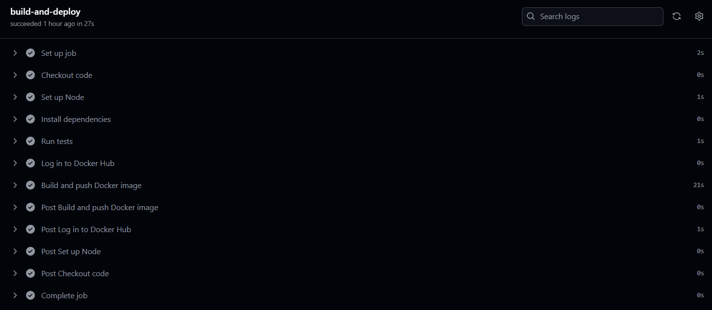

# CI/CD with GitHub Actions, Docker, and Minikube

This project demonstrates a simple Continuous Integration and Continuous Deployment (CI/CD) pipeline using **GitHub Actions**, **Docker**, and **Minikube** (Kubernetes local cluster). No cloud services are required.

## Note = Original Project Repo : https://github.com/AdiJawanjal/CI-CD-GitHub-Action.git (Refer this for CI/CD Authentication)

## 🚀 Project Overview

- A Node.js Express app
- Dockerized and pushed to Docker Hub
- Automatically built and tested via GitHub Actions
- Deployed to Minikube using Kubernetes manifests

---

## 🧰 Tech Stack

- Node.js + Express
- Docker & Docker Hub
- GitHub Actions (CI/CD workflow)
- Kubernetes (Minikube)
- YAML manifests (`Deployment`, `Service`)

---


---

## 🔄 GitHub Actions CI/CD
Workflow Steps:



---

## 🛠️ Setup Instructions

### 1. Clone the Repository

```bash
git clone https://github.com/AdiJawanjal/CI-CD-GitHub-Action.git
cd CI-CD-GitHub-Action
```
### 2. Build & Run Locally (Optional)
```bash
npm install
npm start
```

### 🐳 Docker Setup
Build and run manually:
```bash
docker build -t ci-cd-demo .
docker run -p 3000:3000 ci-cd-demo
```
---
## ☸️ Kubernetes Deployment (Minikube)
```bash
kubectl apply -f deployment.yml
kubectl apply -f service.yml
minikube service ci-cd-service
```
You should see the app running at a URL like: http://<public_ip>:30080

---

## 📸 Deliverables
✅ GitHub Repo

✅ Docker Image: docker.io/<your-username>/ci-cd-demo

✅ GitHub Actions workflow results (see Actions tab)

✅ Screenshots of deployed app (add here)

